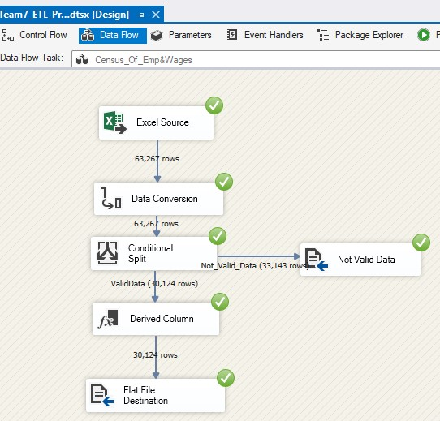
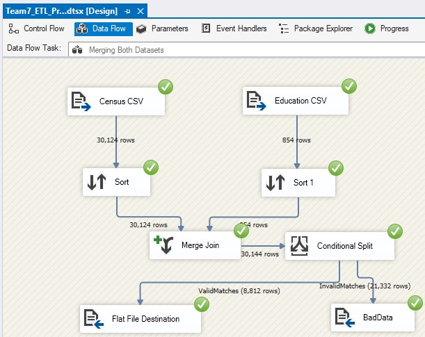
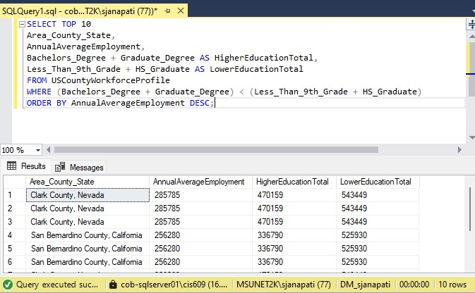
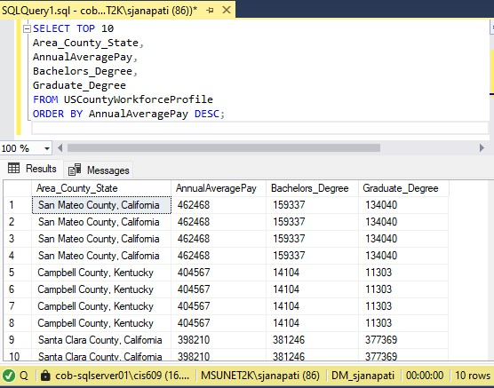

# US Workforce Trends ETL Pipeline

## Overview

This project implements an end-to-end **ETL (Extract, Transform, Load) pipeline** using **SQL Server Integration Services (SSIS)** and **SQL Server**. The pipeline integrates multiple public datasets related to employment, education attainment, and population statistics to create a unified dataset for analyzing workforce trends at the county level.

The project demonstrates practical data engineering workflows including **data extraction, cleaning, transformation, and integration**, enabling workforce analytics using SQL queries.

---

## Objective

The objective of this project is to build a structured and queryable dataset that enables analysis of workforce patterns and regional disparities across counties in the United States.

The ETL pipeline focuses on **cleaning, standardizing, and integrating heterogeneous datasets** to support workforce analytics and data-driven insights.

---

## Data Sources

The ETL pipeline integrates three primary datasets:

* **Census of Employment and Wages (BLS – 2023)**
  ~64,000 records used as the primary workforce dataset.

* **Education Attainment Dataset (2023)**
  ~900 records containing county-level education statistics.

* **Population and Area Density Dataset**
  ~3,000 records providing demographic context for workforce analysis.

All datasets are integrated using **county-level FIPS codes**.

---

## Project Components

### SSIS Packages

* `Team7_ETL_Project.dtsx` – Main ETL workflow integrating multiple datasets
* `Census_data_Clean.dtsx` – Data cleaning pipeline used to prepare raw source data

### Project Configuration

* `Project.params` – Project level parameters and configuration settings
* `sjanapati_ETL_PRJ.dtproj` – SSIS project definition file

### Documentation

* `Docs/` – Screenshots of SSIS workflows and query analysis

---

## ETL Workflow

The ETL pipeline was developed in **SSIS** and performs the following steps:

1. **Data Extraction**
   Import datasets from CSV and Excel files.

2. **Data Cleaning**
   Remove industry code prefixes, standardize geographic identifiers, and filter metadata rows to ensure consistent data structures.

3. **Data Transformation**
   Apply data type conversions, derived columns, and conditional filtering to produce clean and structured datasets.

4. **Data Integration**
   Merge datasets using **SSIS Merge Join transformations** based on county FIPS codes.

5. **Data Loading**
   Load the final integrated dataset into **SQL Server** for querying and analysis.

   ---

## ETL Architecture

The ETL pipeline integrates multiple datasets and processes them through SSIS transformations before loading them into SQL Server for analysis.

Pipeline Flow:

Source Datasets (CSV / Excel)  
        ↓  
Data Cleaning (SSIS Data Flow Tasks)  
        ↓  
Data Transformation (Derived Columns, Conditional Split)  
        ↓  
Dataset Integration (Merge Join using FIPS codes)  
        ↓  
SQL Server Database  
        ↓  
SQL Analysis Queries

## ETL Pipeline

The following screenshots illustrate the SSIS data processing workflow used to clean, transform, and integrate the datasets.

### Data Cleaning and Transformation Pipeline

### Dataset Integration using Merge Join

---

## Business Questions Addressed

The integrated dataset enables analysis of workforce trends such as:

* Which counties demonstrate strong employment levels despite lower education attainment?
* Do counties with higher population and education levels also show higher average wages?
* Which regions have strong educational attainment but relatively lower employment in high-wage industries?

---

## Query Analysis

The integrated dataset was analyzed using SQL queries to answer workforce-related business questions.

### Business Case 1 – Employment vs Education Levels

### Business Case 2 – Population vs Workforce Statistics

---

## Technologies Used

* SQL Server
* SQL Server Integration Services (SSIS)
* SQL Server Data Tools (SSDT)
* T-SQL
* CSV and Excel datasets

---

## Prerequisites

To run this project, the following software is required:

* Microsoft SQL Server (2016 or later)
* SQL Server Management Studio (SSMS)
* SQL Server Data Tools (SSDT)
* SQL Server Integration Services (SSIS)

---

## Setup Instructions

### Step 1 – Create Database

Open **SQL Server Management Studio (SSMS)** and create a new database.

Example:

CREATE DATABASE Workforce_ETL;

---

### Step 2 – Open SSIS Project

Open the project file:

sjanapati_ETL_PRJ.dtproj

in **SQL Server Data Tools (SSDT)**.

---

### Step 3 – Update Connection String

Update the **OLE DB connection** in the SSIS packages to match your SQL Server instance.

---

### Step 4 – Run the ETL Pipeline

Execute the package:

Team7_ETL_Project.dtsx

The pipeline will clean, merge, and load datasets into SQL Server.

---

## Learning Outcomes

This project provided hands-on experience in:

* Designing ETL pipelines using SSIS
* Integrating heterogeneous datasets
* Performing data cleaning and transformation workflows
* Building structured datasets for workforce analytics

---

## License

MIT License
